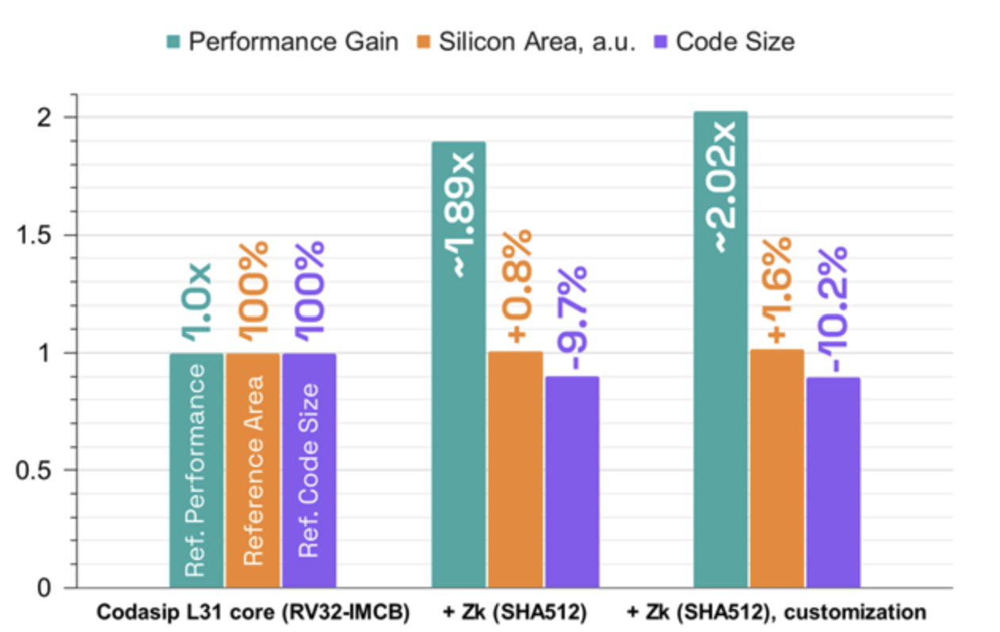

# Index
- [Applications over the years](#applications-over-the-years)
- [FPGA Intro](#fpga)
  - [ANN](#ann)
  - [Genome sequence](#genome-sequencing)
  - [Cryptography](#cryptography)

---
# FPGA vs CPU 

---
# Applications over the years
over the next few slides, lets see how customizing hardware gives us a tiny edge over a full software approach or a full hardware approach, with some couple of study.

---

# ANN
* The following slide shows benchmark in log scale of how perfermance of various AI models are when we consider different architecures.

* It is evident that having architecture specific for the application certainly gives the edge.

[1] [cloud.google.com](https://cloud.google.com/blog/products/compute/performance-per-dollar-of-gpus-and-tpus-for-ai-inference)

---

# Genome Sequencing

* The following shows the instruction split up of a gnome sequencing algorithm [1].

[2] [genomicsbench.eecs.umich.edu](https://genomicsbench.eecs.umich.edu/assets/ispass21_genomicsbench_camera_ready.pdf)

---
# Cryptography

* The following shows speedup due to adding custom instructions or dedicated extensions for a particular application.

[3][effectively-hiding-sensitive-data-with-risc-v-zk-and-custom-instructions](https://codasip.com/2024/01/31/effectively-hiding-sensitive-data-with-risc-v-zk-and-custom-instructions/)

---
# In a nutshell

* sw alone on a traditional architecture(base) lot of cycles so we might want to tweak the hardware a bit.
* Sometimes it is better to build specific hardware which can reduce cycle at a cost (area, power etc..)

---

# A case study

So let us take a `add` as an example